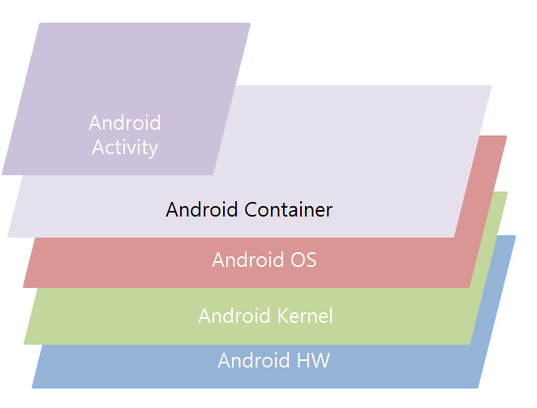
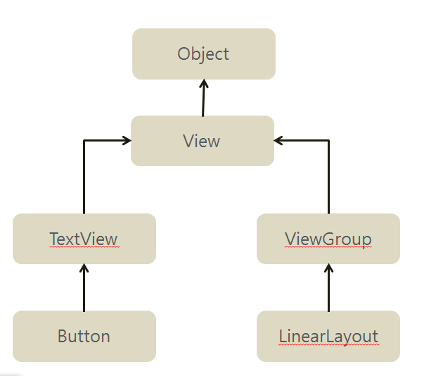

# 둘째 마당

## 01. 안드로이드 스튜디오와 친숙해지기

### 01-2 뷰와 뷰의 크기 속성 이해하기

- Android App 이 돌아가는 구성도

- Widget

  

위젯: 반드시 뷰 그룹이라는 곳에 들어가야 함.

Android activity위에 컨테이너 깔아야 함

컨테이너 위에 위젯들을 붙임.

위젯들은 레이아웃 안에 들어있음.

큰 서비스를 제공할 때는 Layout을 쓰고 아닐 때는 오밀조밀하게 만들어서 배포하기도 함.

- 뷰의 크기 속성
  - match_parent: parent에 맞춤(layout에 맞춤)
  - wrap_content: content에 맞춰서 width, height가 있음.
  - 딱 맞춰서 숫자를 넣을 경우, 버전마다 다를 수 있음. 

## 02 레이아웃  익히기

### 02-1. 안드로이드에 포함된 대표적인 레이아웃 살펴보기

- Linear Layout: 
  - 박스모델
  - 한 쪽 방향으로 차례대로 뷰를 추가 -> 화면 구성
  - 뷰가 차지할 수 있는 사각형 영역 할당.
  - vertical/horizontal 버전이 있음.
- Constraint Layout: 
  - 제약조건 기반 모델
  - 제약조건 사용해 화면 구성하는 방법
  - 안드로이드 스튜디오에서 자동으로 설정하는 디폴트 레이아웃
- Relative Layout
  - 규칙 기반 모델

Android에서는 R.id로 버튼 등의 위젯을 MainActivity에 가지고 옴

알파값 부여 -> 투명도 조정 가능

layout끼리는 layout weight를 줘서 비중을 둠 -> 숫자를 줘서 조정하는 것이 아니라 비율임.

**화면 생성 과정 분석하기**

layout끼리는 layout weight를 줘서 비중을 둠 -> 숫자를 줘서 조정하는 것이 아니라 비율임.

