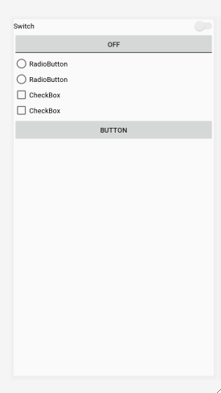

# 20190828

## 03. 기본 위젯과 드로어블 사용하기

### 03-1. 기본 위젯 다시 한 번 자세히 공부하기

- 텍스트뷰 자세히 살펴보기

  - strings.xml은 /app/res 밑에 언어별로 별도로 폴더 만들어서 안에 넣기(안드로이드 다국어 지원)
  - 텍스트뷰의 textColor 속성
    - 약간의 투명도 세팅 가능
  - 텍스트뷰의 textSize 속성
    - dp, sp, px 등을 사용 가능함.
    - 글자 같은 경우는 sp를 , 버튼 같은 경우는 dp를 많이 씀.
  - textStyle
    - 안드로이드 OS에 있는 폰트가 몇 없음, 세련되게 쓰고 싶은 경우 이미지 처리를 함.
  - typeFace
    - 텍스트뷰에서 표시하는 문자열의 폰트를 설정함.

- 버튼

  - 체크를 하는 버튼, 라디오 버튼 등이 있음. 

    ```xml
    <?xml version="1.0" encoding="utf-8"?>
    <LinearLayout xmlns:android="http://schemas.android.com/apk/res/android"
        xmlns:app="http://schemas.android.com/apk/res-auto"
        xmlns:tools="http://schemas.android.com/tools"
        android:layout_width="match_parent"
        android:layout_height="match_parent"
        android:orientation="vertical"
        tools:context=".MainActivity" >
    
        <Switch
            android:id="@+id/switch1"
            android:layout_width="match_parent"
            android:layout_height="wrap_content"
            android:text="Switch" />
    
        <ToggleButton
            android:id="@+id/toggleButton"
            android:layout_width="match_parent"
            android:layout_height="wrap_content"
            android:text="ToggleButton" />
    
        <RadioGroup
            android:layout_width="match_parent"
            android:layout_height="wrap_content">
    
            <RadioButton
                android:id="@+id/radioButton"
                android:layout_width="match_parent"
                android:layout_height="wrap_content"
                android:text="RadioButton" />
    
            <RadioButton
                android:id="@+id/radioButton2"
                android:layout_width="match_parent"
                android:layout_height="wrap_content"
                android:text="RadioButton" />
        </RadioGroup>
    
        <CheckBox
            android:id="@+id/checkBox"
            android:layout_width="match_parent"
            android:layout_height="wrap_content"
            android:text="CheckBox" />
    
        <CheckBox
            android:id="@+id/checkBox2"
            android:layout_width="match_parent"
            android:layout_height="wrap_content"
            android:text="CheckBox" />
    
        <Button
            android:id="@+id/button"
            android:layout_width="match_parent"
            android:layout_height="wrap_content"
            android:text="Button" />
    </LinearLayout>
    ```

    

- 이미지 뷰와 이미지 버튼

### 03-3. 이벤트 처리 이해하기

- 이벤트 처리

  - 버튼 클릭 시 onClick처리

    ```java
    package com.example.p178;
    
    import androidx.appcompat.app.AppCompatActivity;
    
    import android.graphics.Color;
    import android.os.Bundle;
    import android.view.View;
    import android.widget.Button;
    import android.widget.CheckBox;
    import android.widget.CompoundButton;
    import android.widget.EditText;
    import android.widget.RadioButton;
    import android.widget.RadioGroup;
    import android.widget.Switch;
    import android.widget.TabWidget;
    import android.widget.TextView;
    import android.widget.Toast;
    import android.widget.ToggleButton;
    
    public class MainActivity extends AppCompatActivity
    implements View.OnClickListener {
        Button bt;
        RadioButton radioButton, radioButton2;
        CheckBox checkBox;
        CheckBox checkBox2;
        ToggleButton toggleButton;
        Switch switch1;
    
        EditText editText, editText2,  editText3, editText4;
    
        @Override
        protected void onCreate(Bundle savedInstanceState) {
            super.onCreate(savedInstanceState);
            setContentView(R.layout.activity_main);
            bt=findViewById(R.id.button);
            radioButton=findViewById(R.id.radioButton);
            radioButton2=findViewById(R.id.radioButton2);
            checkBox=findViewById(R.id.checkBox);
            checkBox2=findViewById(R.id.checkBox2);
            toggleButton=findViewById(R.id.toggleButton);
            switch1=findViewById(R.id.switch1);
    
            editText=findViewById(R.id.editText);
            editText2=findViewById(R.id.editText2);
            editText3=findViewById(R.id.editText3);
            editText4=findViewById(R.id.editText4);
    
    //        editText.setFocusable(true);
    //        editText3.setFocusable(View.FOCUSABLE);
    
            editText.setOnFocusChangeListener(new View.OnFocusChangeListener() {
                @Override
                public void onFocusChange(View view, boolean b) {
                    if(b==true){ //focus되었다면
                        editText.setHint("typing your name");
                    }else{
                        editText.setHint("");
                    }
                }
            });
            //스위치가 이벤트 처리하는데 괄호 안에서 처리하겠다는 뜻.
            //this를 썼다면 Maniactivity가 처리한다는 것이므로 밑에 함수 써야 함.
            switch1.setOnCheckedChangeListener(new CompoundButton.OnCheckedChangeListener() {
                @Override
                public void onCheckedChanged(CompoundButton compoundButton, boolean b) {
                    if(b==true){
                        Toast.makeText(MainActivity.this, "Switch",Toast.LENGTH_SHORT).show();
                        bt.setBackgroundColor(Color.RED);
                    }else{
                        bt.setBackgroundColor(Color.BLUE);
                    }
                }
            });
    
            toggleButton.setOnCheckedChangeListener(new CompoundButton.OnCheckedChangeListener() {
                @Override
                public void onCheckedChanged(CompoundButton compoundButton, boolean b) {
                    if(b==true){
                        bt.setBackgroundColor(Color.GREEN);
                    }else{
                        bt.setBackgroundColor(Color.LTGRAY);
                    }
                }
            });
            //버튼의 이벤트가 들어오면 누가 처리하겠니?(this)
            //this=MainActivity(버튼에 이벤트 들어오면 MainActivity 가 처리함.)
            bt.setOnClickListener(this);
        }
    
        @Override
        public void onClick(View view) {
    
            Toast.makeText(this,"Click:"+checkBox.isChecked()
                    +radioButton.isChecked()
                    ,Toast.LENGTH_SHORT).show();
        }
    }
    ```

    **이벤트 종류**

    | 속성           |                             설명                             |
    | :------------- | :----------------------------------------------------------: |
    | 터치 이벤트    |          화면을 손가락으로 누를 때 발생하는 이벤트           |
    | 키 이벤트      |        키패드나 하드웨어 버튼 누를 때 발생하는 이벤트        |
    | 제스처 이벤트  | 터치 이벤트 중에서 스크롤과 같이 일정 패턴으로 구분되는 이벤트 |
    | 포커스         |               뷰마다 순서대로 주어지는 포커스                |
    | 화면 방향 변경 |   화면의 방향이 가로와 세로로 바뀜에 따라 발생하는 이벤트    |

    - 제스처 이벤트 

      ```java
      package com.example.p200;
      
      import androidx.appcompat.app.AppCompatActivity;
      
      import android.os.Bundle;
      import android.view.GestureDetector;
      import android.view.MotionEvent;
      import android.view.View;
      import android.widget.TextView;
      
      public class MainActivity extends AppCompatActivity {
          View view, view2;
          TextView textView;
          GestureDetector gestureDetector;
      
          @Override
          protected void onCreate(Bundle savedInstanceState) {
              super.onCreate(savedInstanceState);
              setContentView(R.layout.activity_main);
              setUI();
          }
      
          private void setUI() {
              view = findViewById(R.id.view);
              view2 = findViewById(R.id.view2);
              textView = findViewById(R.id.textView);
              gestureDetector = new GestureDetector(this, new GestureDetector.OnGestureListener() {
                  @Override
                  public boolean onDown(MotionEvent motionEvent) {
                      printMsg("onDown() 호출됨.");
                      return false;
      
                  }
      
                  @Override
                  public void onShowPress(MotionEvent motionEvent) {
                      printMsg("onShowPress() 호출됨.");
                  }
      
                  @Override
                  public boolean onSingleTapUp(MotionEvent motionEvent) {
                      printMsg("onSingleTapUp() 호출됨.");
                      return true;
                  }
      
                  @Override
                  public boolean onScroll(MotionEvent motionEvent, MotionEvent motionEvent1, float v, float v1) {
                      printMsg("onScroll() 호출됨: "+v+", "+v1);
                      return true;
                  }
      
                  @Override
                  public void onLongPress(MotionEvent motionEvent) {
                      printMsg("onLongPress() 호출됨.");
                  }
      
                  @Override
                  public boolean onFling(MotionEvent motionEvent, MotionEvent motionEvent1, float v, float v1) {
                      printMsg("onFling() 호출됨 : "+v+", "+v1);
                      return true;
                  }
              });
              view2.setOnTouchListener(new View.OnTouchListener() {
                  @Override
                  public boolean onTouch(View view, MotionEvent motionEvent) {
                      gestureDetector.onTouchEvent(motionEvent);
                      return true;
                  }
              });
              view.setOnTouchListener(new View.OnTouchListener() {
                  @Override
                  public boolean onTouch(View view, MotionEvent motionEvent) {
                      int action = motionEvent.getAction();
                      float curX = motionEvent.getX();
                      float curY = motionEvent.getY();
      
                      if(action == MotionEvent.ACTION_DOWN){
                          printMsg("Down: "+curX+" "+curY);
                      }else if(action == MotionEvent.ACTION_MOVE){
                          printMsg("Move: "+curX+" "+curY);
                      }else if(action==MotionEvent.ACTION_UP){
                          printMsg("Up: "+curX+" "+curY);
                      }
      
                      return true;
                  }
              });
          }
      
          private void printMsg(String str){
              textView.setText(str+"\n"+textView.getText());
          }
      }
      ```

      - 키 이벤트 처리하기

      ```java
          @Override
          public boolean onKeyDown(int keyCode, KeyEvent event) {
              if(keyCode == KeyEvent.KEYCODE_BACK){
                  Toast.makeText(this, "Back ...", Toast.LENGTH_SHORT).show();
                  return true;
              }
      
              return false;
          }
      }
      ```

      - 가로, 세로로 기울일 때
        - java

      ```java
       @Override
          public void onConfigurationChanged(Configuration newConfig) {
              super.onConfigurationChanged(newConfig);
              if(newConfig.orientation == Configuration.ORIENTATION_LANDSCAPE){
                  showToast("방향 : ORIENTATION_LANDSCAPE");
              }else if(newConfig.orientation == Configuration.ORIENTATION_PORTRAIT){
                  showToast("방향 : ORIENTATION_PORTRAIT");
              }
          }
      ```

      - AndroidManifest.xml

      ```xml
      <activity android:name=".MainActivity" android:configChanges="orientation|screenSize|keyboardHidden">
      ```

      - Bundle:app이 살아있을 때 잠시 정보를 특정한 곳에 저장할 수 있는 공간

      최초에는 savedInstanceState에 아무것도 들어있지 않음.

      화면이 움직이거나 잠시 홈 버튼을 눌러서 화면이 엎어졌다가 다시 나타날 때 임시 방편으로 저장하는 곳

      - SharedPreferences:

        앱을 삭제할 때 죽음

        홈 버튼으로 돌아가도 정보를 가지고 있음.

         

### 03-4. 토스트, 스낵바 그리고 대화상자 사용하기

- 토스트로 띄워줄 내용

  ```xml
  <?xml version="1.0" encoding="utf-8"?>
  <LinearLayout xmlns:android="http://schemas.android.com/apk/res/android"
      xmlns:app="http://schemas.android.com/apk/res-auto"
      android:id="@+id/tlayout"
      android:layout_width="match_parent"
      android:layout_height="match_parent"
      android:orientation="vertical">
  
      <ImageView
          android:id="@+id/imageView"
          android:layout_width="match_parent"
          android:layout_height="573dp"
          app:srcCompat="@drawable/pup1" />
  
      <TextView
          android:id="@+id/textView"
          android:layout_width="match_parent"
          android:layout_height="wrap_content"
          android:text="TextView" />
  </LinearLayout>
  ```

- Toast(java)

  ```java
  public void toast(View view){
          LayoutInflater inflater = getLayoutInflater();
          View tview = inflater.inflate(R.layout.toast,
                  (ViewGroup)findViewById(R.id.tlayout));
          Toast toast = new Toast(this);
          toast.setGravity(Gravity.CENTER, 0, -100);
          toast.setDuration(Toast.LENGTH_LONG);
          toast.setView(tview);
          toast.show();
      }
  ```

- dialog

  ```java
    public void dialog(View view){
          AlertDialog.Builder builder = new AlertDialog.Builder(this);
          builder.setTitle("my dialog");
          builder.setMessage("Do you Exit App ?");
          builder.setIcon(R.drawable.quika1);
          builder.setPositiveButton("OK", new DialogInterface.OnClickListener() {
              @Override
              public void onClick(DialogInterface dialogInterface, int i) {
                  Toast.makeText(MainActivity.this,
                          "OK", Toast.LENGTH_SHORT).show();
                  finish();
              }
          });
          builder.setNegativeButton("NO", new DialogInterface.OnClickListener() {
              @Override
              public void onClick(DialogInterface dialogInterface, int i) {
                  Toast.makeText(MainActivity.this,
                          "NO", Toast.LENGTH_SHORT).show();
              }
          });
          AlertDialog dialog = builder.create();
          dialog.setCancelable(false);
          //modal: 앞의 화면만 건드리고 뒤의 화면은 건드리지 않음.
          dialog.show();
      }
  ```

  