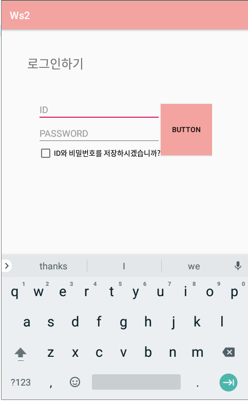

# 20190829

## 04 여러 화면 간 전환하기

### 04-1. 레이아웃 인플레이션 이해하기

### 04-2. 여러 화면 만들고 화면 간 전환하기

**안드로이드의 4대 컴포넌트**

- Activity: 화면을 구성하기 위한 판

- Service: 화면에 보여지지 않고 뒤에서 열심이 일하는 아이(백그라운드에서 돌아감)

- Broadcast Receiver: 전화가 온 것 등 수신된 것을 알려주는 아이(ex. 배터리가 부족해~~)

   									OS에서 부족하니 뭐니 신호 보내면 Receiver가 받아줌.

  ​									 앱 등에서 받아줘서 표시함 

- Content Provider: 전화번호를 가지고 오고 싶음. -> 저장된 데이터를 내가 만든 앱에서 끌어다 쓰

  ​                                 고 싶다.

**Intent 사용**

```java
//다음 액티비티로 이동
    public void clickBt(View view){
        Intent intent = new Intent(MainActivity.this, Main2Activity.class);
        startActivity(intent);
    }
```

- 값을 보낼 때

```java
  //다음 액티비티로 이동
    public void clickBt(View view){
        Intent intent = new Intent(MainActivity.this, Main2Activity.class);
        intent.putExtra("num", 100);
        intent.putExtra("str", "Hi, sY");
        startActivity(intent);
    }
```

- 값을 받을 때

```java
    @Override
    protected void onCreate(Bundle savedInstanceState) {
        super.onCreate(savedInstanceState);
        setContentView(R.layout.activity_main2);
        textView=findViewById(R.id.textView);
        Intent intent=getIntent();
        int num=intent.getIntExtra("num",0);
        String str=intent.getStringExtra("str");
        textView.setText(num+" "+str);
    }

```

- 실습

  - 화면(screen1)

    

  - 화면(screen2)

    

  - 액티비티

    - MainActivity.java

      ```java
      package com.example.p247;
      
      import androidx.appcompat.app.AppCompatActivity;
      
      import android.content.Intent;
      import android.os.Bundle;
      import android.view.View;
      import android.widget.Button;
      import android.widget.TextView;
      
      public class MainActivity extends AppCompatActivity {
          Button bt, bt2, bt3;
          TextView textView;
          @Override
          protected void onCreate(Bundle savedInstanceState) {
              super.onCreate(savedInstanceState);
              setContentView(R.layout.activity_main);
      
              bt=findViewById(R.id.button);
              bt2=findViewById(R.id.button2);
              bt3=findViewById(R.id.button3);
              textView=findViewById(R.id.textView);
              Intent intent=getIntent();
              String imgName= intent.getStringExtra("imgname");
              textView.setText(imgName);
          }
      
          public void clickBt(View view){
              Intent intent=new Intent(getApplicationContext(), Main2Activity.class);
              if(view.getId()==bt.getId()){
                  intent.putExtra("img", R.drawable.grandc1);
              }else if(view.getId()==bt2.getId()){
                  intent.putExtra("img", R.drawable.new1);
      
              }else if(view.getId()==bt3.getId()){
                  intent.putExtra("img", R.drawable.towerbridge);
              }
              startActivity(intent);
          }
      }
      ```

    - Main2Activity.java

      ```java
      package com.example.p247;
      
      import androidx.appcompat.app.AppCompatActivity;
      
      import android.content.Intent;
      import android.os.Bundle;
      import android.view.View;
      import android.widget.Button;
      import android.widget.ImageView;
      
      public class Main2Activity extends AppCompatActivity {
          ImageView imgView;
          Button bt4;
          int imgId;
          @Override
          protected void onCreate(Bundle savedInstanceState) {
              super.onCreate(savedInstanceState);
              setContentView(R.layout.activity_main2);
      
              bt4=findViewById(R.id.button4);
              imgView=findViewById(R.id.imageView);
              Intent intent=getIntent();
              imgId=intent.getIntExtra("img",0);
              imgView.setImageResource(imgId);
          }
      
          public void clickBt(View view){
              Intent intent = new Intent(getApplicationContext(), MainActivity.class);
              if(imgId==R.drawable.grandc1){
                  intent.putExtra("imgname", "Grand Canyon");
              }else if(imgId==R.drawable.new1){
                  intent.putExtra("imgname", "Newziland Image");
              }else if(imgId==R.drawable.towerbridge){
                  intent.putExtra("imgname", "Tower Bridge");
              }
              startActivity(intent);
          }
      }
      ```

 ### 04-6. 액티비티의 수명주기와 SharedPreferences 이해하기

- onCreate(): 시작함

- finish() 호출 시 죽기 전에 onDestroy()호출 -> 소멸 

- 홈 화면으로 가면 onPause -> onStop 호출

- 중지 상태에서 재 호출할 시 onResume() 호출

- 일시정지: 게임하고 있는데 전화가 갑자기 온 상태

Pause와 Resume 중요함

onDestroy는 죽을 때 호출됨.

- ws:

  - ID와 PASSWORD 저장하기

  - MainActivity

    ```java
    dasfdsdpackage com.example.ws2;
    
    import androidx.appcompat.app.AppCompatActivity;
    
    import android.content.Intent;
    import android.content.SharedPreferences;
    import android.os.Bundle;
    import android.view.Menu;
    import android.view.View;
    import android.widget.Button;
    import android.widget.CheckBox;
    import android.widget.EditText;
    import android.widget.Toast;
    
    public class MainActivity extends AppCompatActivity {
        EditText id, password;
        Button bt;
        CheckBox ch;
    
        @Override
        protected void onCreate(Bundle savedInstanceState) {
            super.onCreate(savedInstanceState);
            setContentView(R.layout.activity_main);
    
            id=findViewById(R.id.editText2);
            password=findViewById(R.id.editText);
            bt=findViewById(R.id.button);
            ch=findViewById(R.id.checkBox);
            SharedPreferences pref = getSharedPreferences("pref", MODE_PRIVATE);
            SharedPreferences.Editor editor = pref.edit();
    
            String pr_id=pref.getString("id", null);
            String pr_pwd=pref.getString("pwd", null);
            if(pr_id!=null && pr_pwd!=null){
                if(pr_id.equals("ID01") && pr_pwd.equals("PWD01")){
                    Intent intent = new Intent(getApplicationContext(), MenuActivity.class);
                    startActivity(intent);
                }
            }
        }
    
        public void clickBt(View view){
            if(view.getId()==bt.getId()){
                if(ch.isChecked()){
                    //sharedPreference 만들기
                    //체크박스 체크함(ID, Password 기억함)
                    String str_id=id.getText().toString();
                    String str_pwd=password.getText().toString();
                    if(str_id.equals("ID01") && str_pwd.equals("PWD01")){
                        Intent intent = new Intent(getApplicationContext(), MenuActivity.class);
                        SharedPreferences pref = getSharedPreferences("pref", MODE_PRIVATE);
                        SharedPreferences.Editor editor = pref.edit();
    
                        editor.putString("id", str_id);
                        editor.putString("pwd", str_pwd);
                        editor.commit();
                        startActivity(intent);
                    }
                    else{
                        return;
                    }
                }
            }
        }
    }
    ```

  - MenuActivity.java

    ```java
    package com.example.ws2;
    
    import androidx.appcompat.app.AppCompatActivity;
    
    import android.content.Intent;
    import android.content.SharedPreferences;
    import android.os.Bundle;
    import android.view.View;
    import android.widget.Button;
    
    public class MenuActivity extends AppCompatActivity {
        Button bt_cust, bt_outcome, bt_product;
    
    
        @Override
        protected void onCreate(Bundle savedInstanceState) {
    
            super.onCreate(savedInstanceState);
            setContentView(R.layout.activity_menu);
            bt_cust=findViewById(R.id.button2);
            bt_outcome=findViewById(R.id.button3);
            bt_product=findViewById(R.id.button4);
            Intent intent = getIntent();
        }
    
        public void clickBt(View view){
            Intent intent=null;
            switch(view.getId()){
                case R.id.button2:
                    intent=new Intent(getApplicationContext(), CustomerActivity.class);
                    startActivity(intent);
                    break;
                case R.id.button3:
                    intent=new Intent(getApplicationContext(), OutcomeActivity.class);
                    break;
                case R.id.button4:
                    intent=new Intent(getApplicationContext(), ProductActivity.class);
                    break;
            }
            startActivity(intent);
        }
    
    }
    ```

  - OutcomeActivity.java

    ```java
    package com.example.ws2;
    
    import androidx.appcompat.app.AppCompatActivity;
    
    import android.content.Intent;
    import android.content.SharedPreferences;
    import android.os.Bundle;
    import android.view.View;
    import android.widget.Button;
    
    public class OutcomeActivity extends AppCompatActivity {
    
        Button bt_menu , bt_login;
        @Override
        protected void onCreate(Bundle savedInstanceState) {
            super.onCreate(savedInstanceState);
            setContentView(R.layout.activity_outcome);
    
            bt_menu=findViewById(R.id.button5);
            bt_login=findViewById(R.id.button6);
            Intent intent = getIntent();
        }
    
        public void clickBt(View view){
            Intent intent = null;
            if(view.getId()==bt_menu.getId()){
                intent=new Intent(getApplicationContext(), MenuActivity.class);
                startActivity(intent);
            }else if(view.getId()==bt_login.getId()){
                intent=new Intent(getApplicationContext(), MainActivity.class);
                SharedPreferences pref = getSharedPreferences("pref", MODE_PRIVATE);
                SharedPreferences.Editor editor = pref.edit();
    
                editor.remove("id");
                editor.remove("pwd");
                editor.commit();
                startActivity(intent);
            }
        }
    }
    ```

  - 화면_1

    

  - 화면_2

    

  - 화면_3

    

