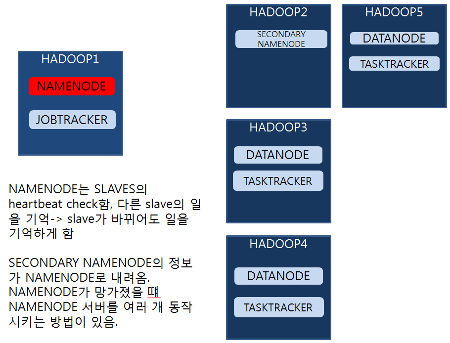
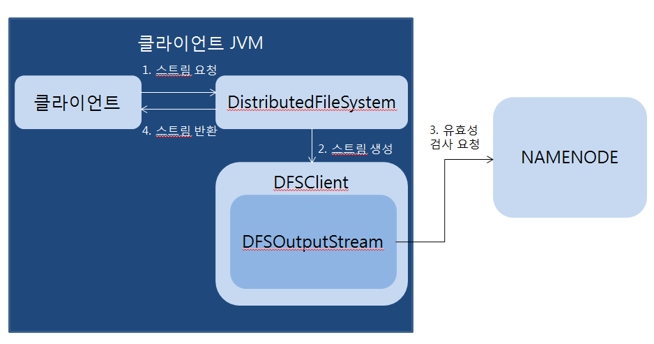

# 03. 하둡 분산 파일 시스템

- HDFS(Hadoop Distributed File System): 

  클라이언트가 저장된 데이터를 빠르게 처리할 수 있게 설계된 파일 시스템

## 3.1 HDFS 기초

- 여러 대의 컴퓨터로 확장, RAID 같은 시스템을 분산환경으로 바꿔줌 

- 분산환경--> 네트워크를 생각해야 함.

- 대용량 파일 시스템과 유사한 점이 많음.

- DAS(Direct-Attached Storage): 

  하드 디스크가 서버 밖에 있음.	

- NAS(Network Attached Storage): 

  미니 컴퓨터, 서버가 존재해야 함.

  디스크만 여러 개 달린 장치, OS가 없다  

  네트워크 속도가 중요하게 여겨짐.

  네트워크를 통해서 공유됨

  윈도우로는 바이러스에 취약해서 파일을 넣었다 뺐다 하지 않음

  ex) 11번가의 이미지는 NAS를 이용해서 저장됨.

- SAN(Storage Area Network):

  수십에서 수백 대의 SAN 스토리지를 데이터 서버에 연결해서 총괄적으로 관리해주는 네트워크를 의미함. 데이터 서버들을 하나로 묶어서 못 들어오게 하는 개념 

  전산실 구축하는 것과 비슷함. 온도 조절이 중요...

  <-> 지금의 방법: 클라우드 구축

- 하둡의 장점: 커다란 파일들을 한 번에 넣었다 뺐다 할 수 있음

-  HDFS의 4가지 목표:

  - 1. 장애복구

       HDFS 구성하는 분산 서버에는 다양한 장애가 발생가능. HDFS는 장애를 빠른 시간에 감지, 대처할 수 있게 설계됨. HDFS에 데이터를 저장하면 복제 데이터도 함께 저장되어 데이터 유실을 방지. 또한 분산 서버 간에는 주기적으로 상태 체크-> 빠른 시간에 장애 인지, 대처 가능하게 도와줌. 

  - 2. 스트리밍 방식의 데이터 접근

       HDFS는 클라이언트의 요청을 빠른 시간 내에 처리하는 것 < 동일한 시간 내에 더 많은 데이터를 처리하는 것

       랜덤 방식의 데이터 접근을 고려하지 않음. 

       -> 인터넷 뱅킹, 인터넷 쇼핑몰 같은 서비스에서 기존 파일 시스템 대신 HDFS 사용하는 것은 부적합함. 

       인터넷 뱅킹 같은 경우 하나의 서버에 요청 -> 결과를 받는 방식

         ex) edonkey

  - 3. 대용량 데이터 저장

       HDFS는 하나의 파일이 기가바이트에서 테라바이트 이상의 크기로 저장될 수 있게 설계됨.

  - 4. 데이터 무결성

       데이터의 입력이나 변경 등을 제한 -> 데이터의 안전성 저해하는 요소를 막음.

       HDFS에서는 한 번 저장한 데이터는 더는 수정할 수 없고, 읽기만 가능하게 함

       -> 데이터 무결성 유지

       데이터 수정은 불가능하지만 파일 이동, 삭제, 복사할 수 있는 인터페이스 제공

       ex) 거래원장

## 3.2. HDFS 아키텍처

### 3.2.1 블록 구조 파일 시스템

- 대용량 -> 빅 데이터 --> 하둡 출현 --> HDFS, MAPREDUCE 제공

- HDFS에 저장하는 파일은 특정 크기의 블록으로 나누어져서 분산 저장됨

- 1GB를 집어 넣으면 64MB로 잘라서 HDFS 블록에 들어감.

- -> 컴퓨터가 4대--> 4개의 블록이 분산되어 들어감, replication은 3개(같은 파일 복제됨) 

- 데이터노드 2의 블록1이 날아가도 블록2, 블록3이 있음을 네임노드가 기억함.

- 1. 디스크 시크 타임의 감소

     하둡 2.0 버전부터는 기본 블록 크기가 127MB로 늘어남.

  2. 네임노드가 유지하는 메타 데이터의 크기가 감소함.(네임노드가 커진다는 것도 리스크임)

     두 블럭의 메타데이터만 저장하면 됨.

  3. 클라이언트와 네임노드의 통신 감소 

     - 파일에 요청을 할 때 3번만 access하면 됨. 
     - 클라이언트가 HDFS에 저장된 파일 접근할 때 네임노드에서 해당 파일을 구성하는 블록의 위치를 조회함. -> 네임노드와 통신할 이유가 없다. 

### 3.2.2 네임노드와 데이터노드

- HDFS 는 마스터-슬레이브(Master-Slave) 아키텍처임.

- Master: 네임노드, Slave: 데이터노드

- 네임노드:

  클라이언트는 네임노드에게만 파일 제어 요청을 함.

  파일 읽기, 쓰기 요청은 클러스터에게 함.

  읽기, 쓰기 응답도 클러스터로부터 온다. 

  - 메타데이터 관리: 

    네임노드는 파일 시스템을 유지하기 위한 메타데이터를 관리함. 

  - 데이터노드 모니터링:

    네임노드에게 3초마다 하트비트 메세지를 전송함. 하트비트는 데이터노드 상태 정보와 데이터노드에 저장되어 있는 블록의 목록으로 구성됨.

  - 블록 관리:

    네임노드는 다양한 방법으로 블록 관리함.

    네임노드는 장애가 발생한 데이터 노드 발견 -> 해당 데이터노드의 블록을 새로운 데이터노드로 복제함.

  - 클라이언트 요청 접수

    클라이언트가 HDFS에 접근하려면 반드시 네임노드에 먼저 접속해야만 함. 

- 데이터노드:

  클라이언트가 HDFS에 저장하는 파일을 로컬 디스크에 유지함. 

  로컬 디스크에 저장되는 파일: 

  - 로우 데이터: 실제 데이터가 저장됨.
  - 메타 데이터가 설정된 파일: 체크섬이나 파일 생성 일자가 설정됨.

### 3.2.3 HDFS의 파일 저장

- HDFS의 파일 저장: 
  1. 클라이언트 -------파일 저장해줘~----> 네임노드
  2. 클라이언트-------패킷---------> 데이터노드
  3. 클라이언트: 파일 저장 완료
     - 클라이언트는 어디에 무엇이 있다~라는 정보를 받음.
     - 실제 데이터를 access하는 것을 클라이언트가 hdfs의 클러스터 안에 있는 데이터 노드에 접속해서 가져옴.
     - edonkey는 열 대의 서버에 다 접속을 해서 각각의 서버로부터 조금씩 가져옴 

- 파일 저장 요청: 

  파일을 저장하기 위한 스트림 생성해야 함.

  

  - 1. 하둡은 FileSystem이라는 추상 클래스에 일반적인 파일 시스템을 관리하기 위한 메서드를 정의함. 이 추상 클래스를 상속받아 각 파일 시스템에 맞게 구현된 다양한 파일 시스템 클래스를 제공함. 

       HDFS에 파일을 저장하는경우: 파일 시스템 클래스 중 DistributedFileSystem을 사용.

       클라이언트는 DistributedFileSystem의 create 메서드 호출 -> 스트림 객체 생성

    2. DistributedFileSystem: 클라이언트에게 반환할 스트림 객체, FSDataOutputStream 생성

       FSDataOutputStream은 데이터 노드와 네임노드의 통신을 관리하는 DFSOutputStream을 래핑하는 클래스.

       DistributedFileSystem은 DFSOutputStream을 생성하기 위해 DFSClient의 create 메서드를 호출

    3. DFSClient는 DFSOutputStream을 생성함. DFSOutputStream은 네임노드의 create 메소드 호출.

       네임노드는 클라이언트의 요청이 유효한지 검사 진행

보조 네임노드: 메타 데이터를 백업함.

각각의 컴퓨터는 하트비트 전송(생사여부)

네임노드가 다른 곳에 들어가는 것은 자유롭게 들어갈 수 있음.  slaves의 상태 모니터링

데이터노드에서 하는 일: 하트비트 데이터 노드에게 전송

저장, 네트워크, 분산환경에 대한 개념이 상당히 잘 최적화되어 있음. 

- 메타 데이터 관리

  파일 시스템 이미지와 파일에 대한 블록 매핑 정보로 구성됨.

  네임 노드는 클라이언트에게 빠르게 응답할 수 있게 메모리에 전체 메타 데이터를 로딩해서 관리함 

- 데이터 모니터링

  네임노드에게 3초마다 하트미트 메시지 전송

  하트비트: 데이터 노드 상태 정보 , 블록의 목록(블록리포트)로 구성됨.

  네임노드는 하트비트 이용 -> 데이터노드의 실행 상태와 용량을 모니터링함.

- 블록 관리

  장애가 발생한 데이터 노드 발견 -> 해당 데이터노드의 블록을 새로운 데이터노드로 복제 

  복제본 수도 관리함. 

- 클라이언트 요청 접수

  클라이언트가 HDFS에 접근하려면 먼저 네임노드에 접속해야만 함.

  HDFS에 파일을 저장하는 경우 기존 파일의 저장 여부와 권한 확인의 절차를 거쳐서 저장 승인, HDFS 에 저장된 파일을 조회하는 경우 블록의 위치 정보 반환.

- 데이터 노드

  ### 3.2.3 HDFS의 파일 저장

  클라이언트가 네임노드에게 파일 저장을 요청하는 단계, 

  클라이언트가 데이터노드에게 패킷을 전송하는 단계

  클라이언트가 파일 저장을 완료하는 단계로 구성됨.

  ​

  - 블록 조회
    1. 클라이언트는 입력 스트림 객체의 read 메서드 호출 -> 스트림 조회 요청
    2. DFSInputStream은 첫번째 블록과 가장 가까운 데이터 노드를 조회

  ### 3.2.5 보조 네임노드

  editslog는 HDFS의 모든 변경 이력 저장함.

  - 1. 네임노드 구동 -> 로컬에 저장된 fsimage와 editslog를 조회
    2. 메모리에 fsimage를 로딩-> 파일 시스템 이미지를 생성
    3. 메모리에 로딩된 파일 시 

  ## 3.3 HDFS 명령어

  - ls
  - lsr
  - 파일 용량 확인 - du, dus
    - du
    - dus

## 3.4 클러스터 웹 인터페이스

## 3.5 HDFS 입출력 예제(MAPREDUCE)

맵리듀스<-- 손이 많이 감. 

