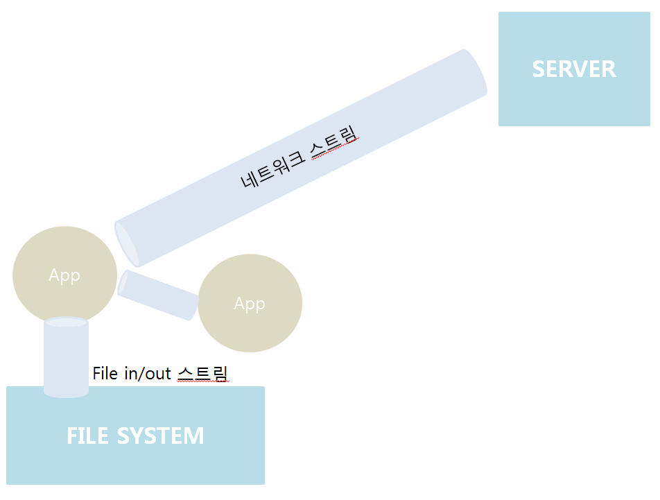

# 20190919

# Ch 15. 입출력

## 1. 자바에서의 입출력

### 1.1 입출력이란?

I/O: Input과 Output의 약자로 입력과 출력(->입출력이라고 함)

### 1.2 스트림(Stream)

- 스트림: 데이터를 주거니 받거니 하는 공간

  - 스트림으로 데이터 보낼 때는 기본적으로 1바이트씩 잘라서 보냄 
  - 문서를 보내도 1바이트씩 잘라서 보냄(기본)
  - 바이트에서 읽은 내용을 이미지화시켜서 보여줬었음 
  - 바이트 단위로 읽어서 체크함 
  - 둘 다 자바(App과 Server가 java기반인 경우)면 2바이트씩 보낼 수 있음 (‘안’이라는 애를 그래도 쏨) 
  - 스트림 안에 스트림이 있을 수 있음. 

- 1기가를 1바이트씩 잘라서 

  - App과 filesystem이 상호작용하면..? 

    -> 시간 오래 걸리겟지

  - 버퍼를 두고 싶으면 App에 버퍼를 둠 

  - 버퍼가 3MB면 ?

  - 빨라진다..!

  - 버퍼 내용을 한 번에 읽어들임 

  - 안 쓰는 프로그램 거의 없음.

- 왜 쓰레드를 쓰는가?

  - 메인 쓰레드는 돌고 있는 상황에서 멀티 쓰레드가 1G를 빨아들이면서 다른 행동을 할 수 있음

  - 네트워크, I/O 사용 시 대부분 쓰레드를 이용한다. 

- 한글 깨지는 문제: 한 바이트씩 오니까 
  포트가 있어야 다른 컴퓨터로 들어갈 수 있음.
  IP 알아야 함
  대표적으로 80포트, 톰캣 8080포트 오라클 1521 포트 

  대외적으로 서비스하는 것들은 80포트 말고 다 막아 놓음
  안 막으면 중국 애들이 쳐들어 옴 

### 1.5 문자기반 스트림-Reader, Writer

- InputStream -> Reader
- OutputStream -> Writer
- Reader, WRiter는  Java 대 Java 일 떄 사용함
- InputStream, OutputStream: 1바이트씩 읽음
- Reader, Writer: 2바이트씩 읽음
- 장점: '안녕' 을 읽을 때 2번 읽음

## 3. 바이트기반의 보조 스트림

### 3.1 FilterInputStream과 FilterOutputStream

### 3-2. BufferredInputStream과 BufferedOutputStream

- flush: 버퍼에 있는 내용 다 버려라
- bos.close(): 버퍼 내용 다 출력해라

## 4. 문자기반 스트림

### 4.3 PipedReader와 PipedWriter

## 5. 문자기반의 보조스트림

- Reader와 BufferedReader를 써도 2byte 체계에서 다 해결됨 

## 6.표준입출력과 File

### 6.4 File

- File 객체의 여러 가지 정보들을 끄집어낼 수 있음.
- 파일 받아서 내 시스템에 저장

## 7. 직렬화(Serialization)

- 자바에서는 스트림으로 Object를 보낼 수 있음.(장점)
  - 그런데 둘 다 Java여야 가능
  - -> 이 한계를 극복하고자 json을 사용하기도 함(이 아이는 그저 텍스트일 뿐임)
  - 은행과 보험사 등 
- 객체를 만들어서 얘를 Write/Read 할 수 있다. 

# Ch 16. 네트워킹

- 컴퓨터를 서로 연결하여 데이터를 주거니 받거니 하는 것에서 시작됨
- 전세계 컴퓨터가 하나로 묶인 것= World Wide web -> http 프로토콜 택함(필요할 때마다 서버에 갔다옴)

### 1.1 클라이언트/서버(client/server)

- 여러 대의 클라이언트가 하나의 서버에 접속하게 됨

- 서버 기반모델(server-based model): 지금의 웹 서버 생각하면 됨

- P2P 모델(Peer-to-Peer)

- 최근~~: (server-client 모델): 가상머신 띄워서 서버의 것을 띄움.

- 종류: 

  - SMTP(메일용)- 다음 애들이 핫했던 부분, 버릴 수 없음, 시스템 구조 =  옛날 것
  - FTP: 파일 전송 프로토콜
  - TCP/IP: a라는 컴퓨터와 b라는 컴퓨터가 연결되어있다면 얘네끼리 통신(이 때 사용하는 규약; TCP/IP)
  - HTTP: html 왔다갔다 함

  

### 1.2 IP 주소

- 32비트의 4가지 영역
- 서브넷 마스크: A클래스, B 클래스, C 클래스
- 255.255.0.0 - > B 클래스

### 1.3 InetAddress

- Url 정보에 hostaddress 등 해당 ip에 해당하는 정보들을 끄집어낼 수 있음.
- 이런 클래스가 존재함
- IP address를 관리하고 확인하기 위한 목적임

### 1.4 URL

- http://www.naver.com 과 같은 것
- '프로토콜://호스트명:포트번호/경로명/파일명?쿼리스트링#참조'의 형태로 이루어짐

### 1.6. URLConnection

- Android에서 했었음.