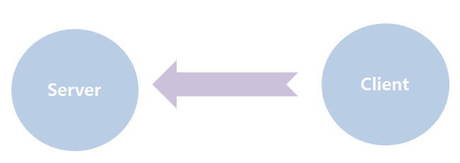

# 20190920

## File 을 주고 받을 때

- FileOutputStream을 사용해서 받은 파일을 저장

- 이 때, BufferedOutputStream 을 사용해서 파일 받는 속도를 빠르게 함!

  ```java
  package http2;
  
  import java.io.BufferedInputStream;
  import java.io.BufferedOutputStream;
  import java.io.FileOutputStream;
  import java.io.InputStream;
  import java.net.URL;
  
  public class Http2 {
  
  	public static void main(String[] args) 
  			throws Exception {
  		String urlstr="http://70.12.60.90/test/oracle.zip";
  		URL url=new URL(urlstr);
  		InputStream is =url.openStream();
  		BufferedInputStream bis 
  		= new BufferedInputStream(is,1024);
  		
  		int data=0;
  		//oracle.zip 
  		String fileName="oracle.zip";
  		FileOutputStream fo = new FileOutputStream(fileName);
  		BufferedOutputStream bos
  		= new BufferedOutputStream(fo);
  		
  		System.out.print("Start...");
  		while((data=bis.read()) != -1) {
  //			//저장 
  //			System.out.print("*"+data);
  			bos.write(data);
  		}
  		System.out.println("Finish..");
  		is.close();
  		bos.flush();
  		bos.close();
  	}
  }
  ```

## 2. 소켓 프로그래밍

### 2.1 TCP와 UDP

- A컴퓨터 B컴퓨터가 통신하면 그 둘을 end point라고 함
- 프로세스간의 통신을 위해서는 반드시 **소켓**이 필요함.
- API 를 자바가 제공하고 있음. 
- TCP / IP: 컴퓨터와 컴퓨터끼리 통신을 하기 위한 규약
  - 컴퓨터의 종류와 상관 없음. 
  - TCP, UDP가 있음. 
  - TCP: 1대 1통신방식
    - 신뢰성 보장
    - 전송속도 느림
  - UDP: 1대 다 통신방식
    - 신뢰성 보장 안 됨
    - 한 사람이 소포를 10명에게 보냄.
    - 보낸 사람은 잘 갔는지 확인 안 함 ㅋㅋ... 
    - 빠르지만 정확성이 좀 ...
- HTTP: 브라우저와 웹 서버 간의 규약
- 

- ```java
  package tcp1;
  
  import java.net.Socket;
  
  public class Client {
  	
  	String ip;
  	int port;
  	
  	Socket socket;
  	
  	
  	public Client(String ip, int port) {
  		this.ip=ip;
  		this.port=port;
  	}
  	public static void main(String[] args) {
  		Client client = null;
  		client = 
  		new Client("70.12.60.90", 8888);
  	}	
  }
  
  ```

- ```java
  package tcp1;
  
  import java.io.BufferedWriter;
  import java.io.IOException;
  import java.io.OutputStream;
  import java.io.OutputStreamWriter;
  import java.net.ServerSocket;
  import java.net.Socket;
  
  public class Server {
  	int port;
  	ServerSocket serverSocket;
  	Socket socket;
  	//네트워크를 하기 위해 양쪽 다 있어야 함 
  	
  	OutputStream out;
  	OutputStreamWriter osw;
  	BufferedWriter bw;
  	
  	public Server(int port) throws IOException{
  		this.port=port;
  		serverSocket= new ServerSocket(port);
  		
  	}
  	
  	public void startServer() throws IOException {
  		System.out.println("Server Start..");
  		try {
  			System.out.println("Server Ready..");
  			socket = serverSocket.accept();
  			System.out.println("Accepted.."+
  			socket.getInetAddress());
  			
  			out=socket.getOutputStream();
  			osw=new OutputStreamWriter(out);
  			bw = new BufferedWriter(osw);
  			bw.write("hello");
  			
  		}catch(IOException e) {
  			throw e;
  		}finally {
  			if(bw != null) {
  				bw.close();
  			}
  			if(socket != null) {
  				socket.close();
  			}
  		}
  		System.out.println("Server end..");
  	}
  	
  	public static void main(String[] args) {
  		Server server=null;
  		try {
  			server=new Server(8888);
  			server.startServer();
  		
  		} catch (IOException e) {
  			e.printStackTrace();
  		}
  	}
  	
  }
  
  ```