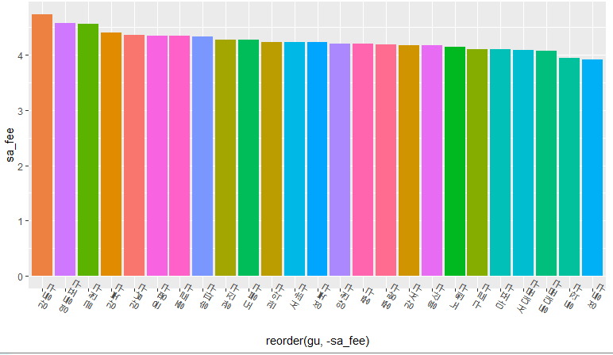
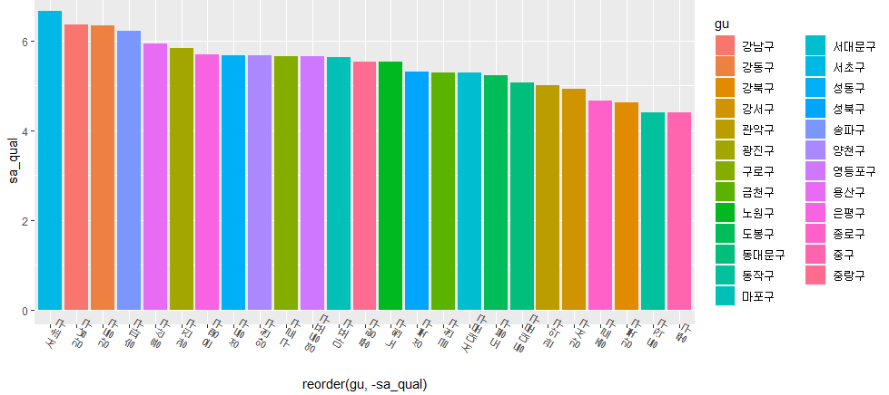
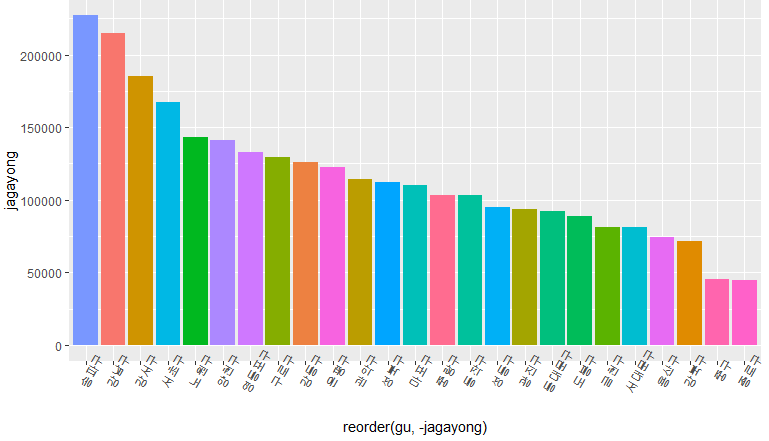
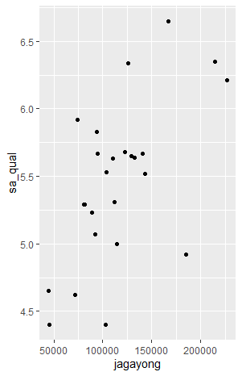

```R
st <- read.csv("student2.csv",
               header=TRUE,
               stringsAsFactors = FALSE,
               na.strings = "NA",
               encoding = "EUC-KR")
st[st$KO >= 90, ]
st[st$KO >= 90 & st$SI >= 80 , c("KO","SI")]
# 조건을 써서 데이터 끄집어 낼 수 있음.
st$AVG <- rowMeans(st[,c(3:5)])
st$CLASS <- c(1,1,1,2,2,2,3,3)

# 묶음: class, 평균을 구할 대상:AVG, data: st
# 시간대별, 월별 등으로 group by 할 떄 사용함. 
aggregate(data=st[st$KO>=90,],AVG~CLASS,mean)
```

### 15-2 변수 타입

**1. 연속 변수 - Numeric 타입**

**2. 범주 변수 - Factor 타입**

**다양한 변수 타입들**

- numeric
- integer
- complex
- character
- logical
- factor
- Date

### 15-3 데이터 구조

#### 1. 벡터

- 하나의 데이터: 스칼라
- 벡터: 2개 이상의 값으로 구성된 데이터 구조, 여러 변수 타입을 섞을 수 없음.

#### 2. 데이터 프레임

#### 3. 매트릭스

#### 4. 어레이

#### 5. 리스트

- 키, value로 이루어짐

  # 4. 데이터 프레임의 세계로!

## 4-1. 데이터는 어떻게 생겼나?

데이터 프레임; 엑셀의 모형 등을 떠올릴 수 있음.

## 4-3. 외부 데이터 이용하기

```R
> install.packages("readxl")
> library(readxl)
> st <- read_excel("st.xlsx")
# 워크 스페이스 말고 다른 장소에 있는 경우, 절대경로를 써주되 슬래시 대신 역슬래시 쓰기
```

- 컬럼이름을 가지고 오고 싶지 않은 경우 read_excel("excel.xlsx", col_names=F) 쓰기

- 시트가 여러 개 있다면?

  ```R
  df_exam <- read_excel("excel.xlsx", sheet=3)
  ```

# 5. 데이터 분석 기초

- head

- tail

- View

- dim

- str()

- summary()

  ```R
  > summary(st)
         ID        CLASS          MATH          ENG           SCI    
   Min.   :1   Min.   :1.0   Min.   : 70   Min.   : 70   Min.   :71  
   1st Qu.:2   1st Qu.:1.0   1st Qu.: 80   1st Qu.: 80   1st Qu.:81  
   Median :3   Median :2.0   Median : 90   Median : 90   Median :88  
   Mean   :3   Mean   :1.8   Mean   : 86   Mean   : 86   Mean   :86  
   3rd Qu.:4   3rd Qu.:2.0   3rd Qu.: 90   3rd Qu.: 90   3rd Qu.:91  
   Max.   :5   Max.   :3.0   Max.   :100   Max.   :100   Max.   :99 
  ```

  1st Qu: 1사분위수(하위 25%)

  3st Qu: 3사분위수 (상위 25%)

  Median: 중앙에 위치하는 값

  Mean:  평균값

  ​

## 05-2 변수명 바꾸기

- dplyr: 여러 가지 좋은 함수들의 묶음

  - rename: 특정 변수 이름 바꾸기

    ```R
    > st <- rename(st, MA=MATH)
    > st
    # A tibble: 5 x 5
         ID CLASS    MA   ENG   SCI
      <dbl> <dbl> <dbl> <dbl> <dbl>
    1     1     1    90    90    91
    2     2     1    80    80    81
    3     3     2    70    70    71
    4     4     2   100   100    99
    5     5     3    90    90    88
    ```

    컬럼 명칭은 매우 중요함.

    ​

### 05-3. 파생변수 만들기

```R
> st$AVG <- rowMeans(st[,c(3:5)])

> st
# A tibble: 5 x 6
     ID CLASS    MA   ENG   SCI   AVG
  <dbl> <dbl> <dbl> <dbl> <dbl> <dbl>
1     1     1    90    90    91  90.3
2     2     1    80    80    81  80.3
3     3     2    70    70    71  70.3
4     4     2   100   100    99  99.7
5     5     3    90    90    88  89.3
```

- 합격판정 변수 만들기

  ```R
  st$LEVEL <- ifelse(st$AVG >= 90, "PASS","FAIL")
  st$grade <- ifelse(st$AVG >= 90, "A",
                     ifelse(st$AVG >= 80, "B",
                            ifelse(st$AVG >= 70, "C","F")))
  ```

- 빈도표

  ```R
  > table(st$grade)

  A B C 
  2 2 1 
  > ta <- table(st$grade)
  > class(ta)
  [1] "table"
  ```

# 06. 자유자재로 데이터 가공하기

## 06-1 데이터 전처리-원하는 형태로 데이터 가공하기

전처리 과정 = raw데이터를 추출해서 원하는 형태로 가공하는 과정 

## 06-2 조건에 맞는 데이터만 추출하기

```R
st %>% 
  filter(CLASS==1)
st[st$CLASS==1,]
```

# 07. 데이터 정제

정제: 오차 데이터, NA 데이터 등 없애는 것 

# 08. 그래프 만들기

```R
library(ggplot2)
ggplot(data=mpg, aes(x=displ, y=hwy))+
  geom_point()
```

## 08-3. 막대 그래프-집단 간 차이 표현하기

```R
library(ggplot2)
mpgta <- table(mpg$class)
cc <- as.data.frame(mpgta)
cc
colnames(cc) <- c("CLASS", "CNT")
cc

ggplot(data=cc, aes(x=reorder(CLASS,CNT), y=CNT))+
  geom_col()


ggplot(data=mpg, aes(x=class))+
  geom_bar()

# class별 hwy 연비 평균을 그래프로 그려보기
library(ggplot2)
mpg2 <- aggregate(data=mpg, hwy~class, mean)
mpg2

ggplot(data=mpg2, aes(x=class, y=hwy))+
  ylim(0, 40)+
  geom_col()
```
## Workshop

- 서울의 각 자치구의 자가용의 수와 사교육비, 사교육의 질과의 관계를 보고자 했습니다.

  ```R
  library(readxl)
  library(ggplot2)
  library(dplyr)
  sagyouk <-read_excel("data1.xls")
  str(sagyouk)
  View(sagyouk)
  sagyo2 <- sagyouk[c(36:60),c(3,5,6)]
  str(sagyo2)
  cars <- read_excel("data2.xls")
  str(cars)
  View(cars)

  car2<- cars[c(3:27),c(2,5)]
  car2
  View(car2)
  View(sagyo2)

  car2 <- rename(car2, jagayong=합계...5, gu=자치구)
  car2

  sagyo2 <- rename(sagyo2, sa_fee=`사교육 환경...5`, gu=분류, sa_qual=`사교육 환경...6`)
  sagyo2

  total <- left_join(car2, sagyo2, by="gu")
  total
  View(total)

  total <- total[order(total$jagayong, decreasing=T),]
  total$jagayong <- as.numeric(total$jagayong)
  total$sa_fee <- as.numeric(total$sa_fee)
  total$sa_qual <- as.numeric(total$sa_qual)
  str(total)

  ggplot(data=total, aes(x=jagayong, y=sa_fee))+
    geom_point()

  ggplot(data=total, aes(x=jagayong, y=sa_qual))+
    geom_point()

  ggplot(data=total, aes(x=reorder(gu, -sa_fee), y=sa_fee, fill=gu))+
    theme(axis.text.x = element_text(angle = 60))+
    geom_col()

  ggplot(data=total, aes(x=reorder(gu, -sa_qual), y=sa_qual, fill=gu))+
    theme(axis.text.x = element_text(angle = 60))+
    geom_col()


  ggplot(data=total, aes(x=reorder(gu, -jagayong), y=jagayong, fill=gu))+
    theme(axis.text.x = element_text(angle = 60))+
    geom_col()
  ```

  -  사교육비로 정렬한 구들

    


  - 사교육의 질로 정렬한 구들

    

  - 자가용의 수로 정렬한 구들

    

  - 자가용과 사교육비의 관계(산점도)

    

  - 자가용과 사교육의 질의 관계(산점도)

    