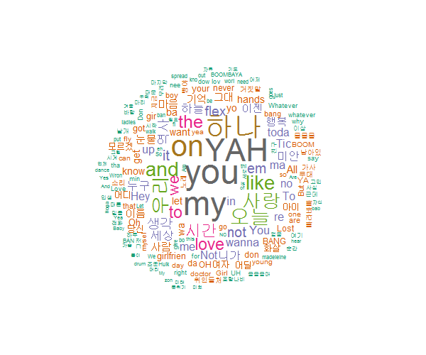
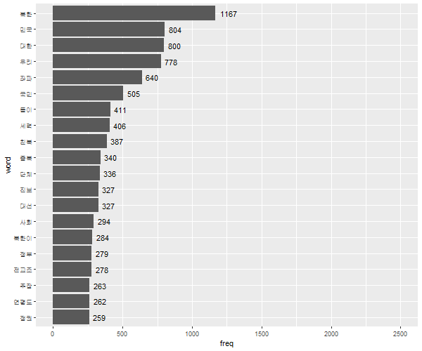
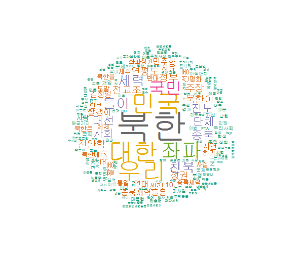
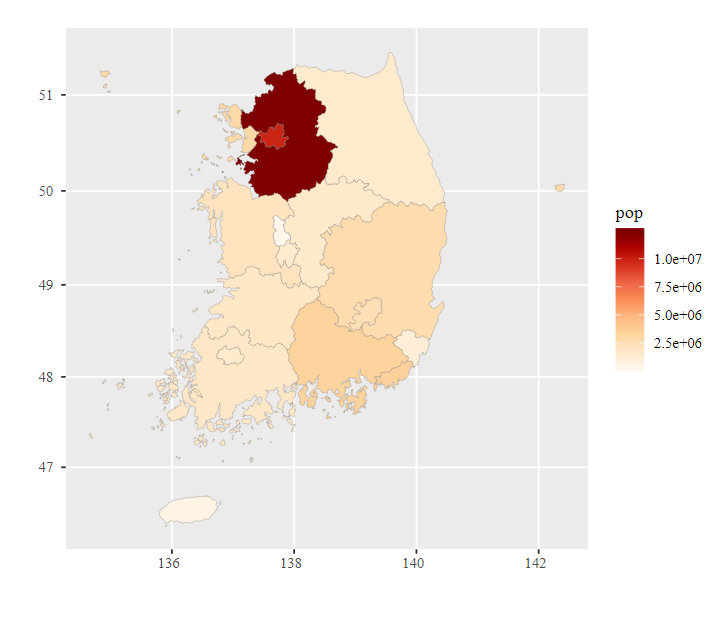
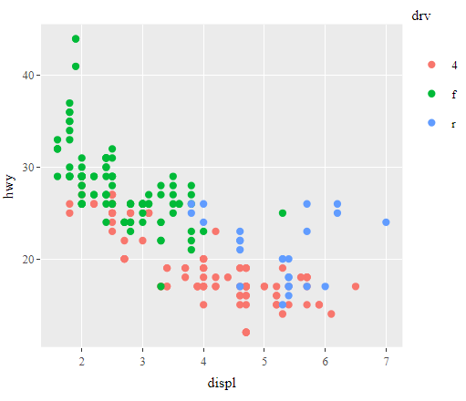
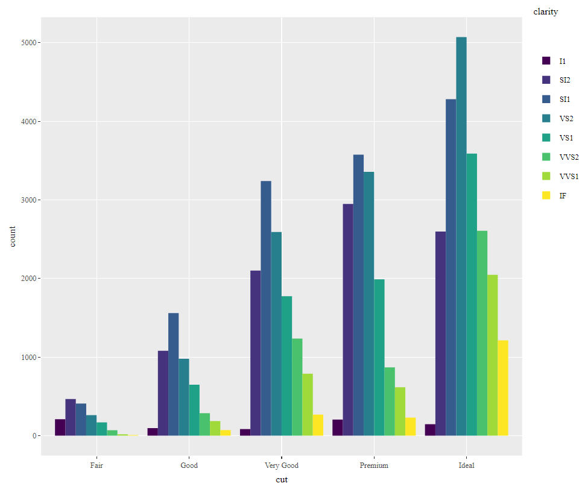
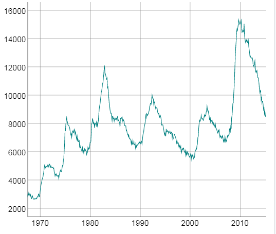
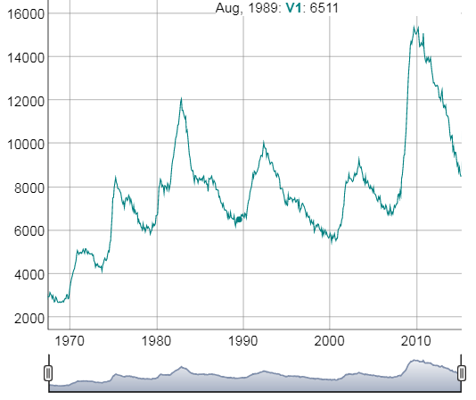
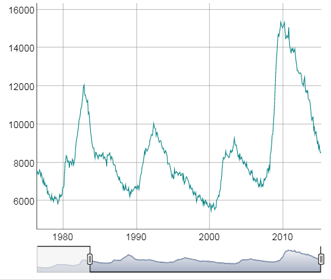
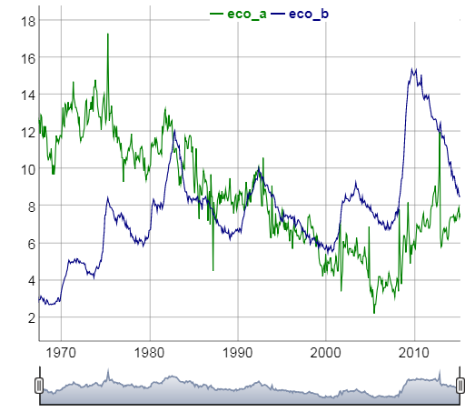

# 20190820 R 정리

- 그래프를 저장

  ``` R
  library(ggplot2)
  mpg2 <- aggregate(data=mpg, hwy~class, mean)
  mpg2
  png("gg.png", width=600, height=500)
  # gg.png라는 이름으로 파일을 디렉터리에 저장한다.
  ggplot(data=economics, aes(x=date, y=psavert))+
    geom_line()
  dev.off()
  ```

# 10. 텍스트 마이닝

## 10-1. 힙합 가사 텍스트 마이닝

어절들이 어떤 품사로 되어 있는 지 파악하는 '형태소 분석'을 가장 먼저 함 

-> Dictionary 라는 아이가 함.(명사가 아닌 형용사, 부사 등 추출)

**텍스트 마이닝 준비하기**

- 1. 패키지 준비하기

     KoNLP 이용 -> 한글 데이터로 형태소 분석 가능

     KoNLP는 자바가 설치되어 있어야 사용이 가능함.

- 2. KoNLP를 사용하려면 rJAVA, memoise 패키지가 설치되어 있어야 함.

     ```R
     > install.packages("rJava")
     > install.packages("memoise")
     > install.packages("KoNLP")
     ```

- 3. KoNLP와 dplyr 로드

     ```R
     > library(KoNLP)
     > library(dplyr)
     ```

- 4. 사전 설정하기

     ```R
     useNIADic()
     ```

- 5. 데이터 준비하기

     ```R
     txt <- readLines("hiphop.txt")
     head(txt)
     ```

- 6. 특수문자 제거하기

     ```R
     library(stringr)
     txt <- str_replace_all(txt, "\\W", " ")
     ```

**가장 많이 사용된 단어 알아보기**

- 1. 명사 추출하기

     ```R
     nouns <- extractNoun(txt)
     ```

- 2. table로 빈도표 나타내기

     ```R
     cnt <- table(unlist(nouns))
     ```

- 3. 자주 사용된 단어 빈도표 만들기

     가장 많이 사용된 20개 단어를 나타낸 단어 빈도표 만들기~~ 

     한 글자로 된 단어는 의미가 없음 --> nchar를 이용해서 두 글자 이상으로 된 단어만 추출

     ```R
     df_word <- filter(df_cnt, nchar(word) >= 2)
     df_word
     ```

- 4. 빈도 순으로 정렬 , 상위 20개 단어 추출

     ```R
     top_20 <- df_word %>% 
       arrange(desc(freq)) %>% 
       head(20)
     top_20
     ```

**워드 클라우드 만들기**

- 1. 패키지 준비하기

     ```R
     > install.packages("wordcloud")

     > library(wordcloud)
     필요한 패키지를 로딩중입니다: RColorBrewer
     > library(RColorBrewer)
     ```

- 2. 단어 색상 목록 만들기

     ```R
     > pal <- brewer.pal(8, "Dark2")
     ```

- 3. 난수 고정하기

     ```R
     set.seed(1234)
     ```

- 4. 워드 클라우드 만들기

     많이 사용된 단어일수록 글자가 크고 가운데에 배치됨, 덜 사용되는 단어일수록 글자가 작고 바깥쪽에 배치되는 형태

     ```R
     wordcloud(words=df_word$word,
               freq=df_word$freq,
               min.freq=2,
               max.words=200,
               random.order=F,
               rot.per=.1,
               scale=c(4,0.3),
               colors=pal)
     ```

     

## 10-2. 국정원 트윗 텍스트 마이닝

**국정원 트윗 텍스트 마이닝**

-  1. 데이터 준비하기

      ```R
      twitter <- read.csv("twitter.csv",
                            header=T,
                            stringsAsFactors = F,
                            fileEncoding="UTF-8")

      # 변수명 수정
      twitter <- rename(twitter, 
                        no=번호,
                        id=계정이름,
                        date=작성일,
                        tw=내용)

      # 특수문자 제거
      twitter$tw <- str_replace_all(twitter$tw, "\\W", " ")
      head(twitter$tw)
      ```

-  2. 단어 빈도표 만들기

      트윗에서 명사 추출, 각 단어가 몇 번씩 사용되었는지 나타낸 빈도표 만듦.

      ```R
      #트윗에서 명사 추출
      nouns <- extractNoun(twitter$tw)

      #추출한 명사 list를 문자열 벡터로 변환, 빈도표
      wordcount <- table(unlist(nouns))
      head(wordcount)

      #데이터 프레임으로 변환
      df_word <- as.data.frame(wordcount, stringsAsFactors = F)
      str(df_word)
      # 변수명 수정
      df_word <- rename(df_word,
                        word=Var1,
                        freq=Freq)
      ```

-  3. 두 글자 이상으로 된 단어 추출, 빈도 순으로 정렬

      ```R
      # 두 글자 이상 단어만 추출
      df_word <- filter(df_word, nchar(word)>=2)

      # 상위 20개 추출
      top20<- df_word %>% 
        arrange(desc(freq)) %>% 
        head(20)
      top20

           word freq
      1    북한 1167
      2    민국  804
      3    대한  800
      4    우리  778
      5    좌파  640
      6    국민  505
      7    들이  411
      8    세력  406
      9    친북  387
      10   종북  340
      11   단체  336
      12   대선  327
      13   진보  327
      14   사회  294
      15 북한이  284
      16   정부  279
      17 전교조  278
      18   주장  263
      19 연평도  262
      20   정권  259
      ```

-  4. 단어 빈도 막대 그래프 만들기

      ```R
      > png("plot1.png", width=600, height=500)
      > ggplot(data=top20, aes(x=word, y=freq))+
      +   ylim(0, 2500)+
      +   geom_col()+
      +   coord_flip()+
      +   scale_x_discrete(limit = order)+
      +   geom_text(aes(label=freq), hjust=-0.3)
      ```

   

   - 5. 워드 클라우드 만들기

   ```R
   wordcloud(words=df_word$word,
             freq=df_word$freq,
             min.freq=10,
             max.words=200,
             random.order=F,
             rot.per=.1,
             scale=c(6,0.2),
             colors=pal)
   ```

   

# 11. 지도 시각화

## 11-2. 대한민국 시도별 인구, 결핵 환자 수 단계 구분도 만들기

**대한민국 시도별 인구 단계 구분도 만들기**

1. 패키지 준비하기

   ```R
   > install.packages("stringi")
   > install.packages("devtools")
   > devtools::install_github("cardiomoon/kormaps2014")
   > library(kormaps2014)
   ```

2. 대한민국 시도별 인구 데이터 준비하기

   ```R
   > str(changeCode(korpop1))
   'data.frame':	17 obs. of  25 variables:
    $ C행정구역별_읍면동     : chr  "'11" "'21" "'22" "'23" ...
    $ 행정구역별_읍면동      : chr  "서울특별시" "부산광역시" "대구광역시" "인천광역시" ...
    $ 시점                   : chr  "2015" "2015" "2015" "2015" ...
    $ 총인구_명              : chr  "9904312" "3448737" "2466052" "2890451" ...
    $ 남자_명                : chr  "4859535" "1701347" "1228511" "1455017" ...
    $ 여자_명                : chr  "5044777" "1747390" "1237541" "1435434" ...
    $ 내국인_계_명           : chr  "9567196" "3404667" "2436770" "2822601" ...
    $ 내국인_남자_명         : chr  "4694317" "1675339" "1211219" "1414793" ...
    $ 내국인_여자_명         : chr  "4872879" "1729328" "1225551" "1407808" ...
    $ 외국인_계_명           : chr  "337116" "44070" "29282" "67850" ...
    $ 외국인_남자_명         : chr  "165218" "26008" "17292" "40224" ...
    $ 외국인_여자_명         : chr  "171898" "18062" "11990" "27626" ...
    $ 가구_계_가구           : chr  "3914820" "1348315" "937573" "1066297" ...
    $ 일반가구_가구          : chr  "3784490" "1335900" "928528" "1045417" ...
    $ 집단가구_가구          : chr  "2261" "686" "574" "713" ...
    $ 외국인가구_가구        : chr  "128069" "11729" "8471" "20167" ...
    $ 주택_계_호             : chr  "2793244" "1164352" "738100" "942244" ...
    $ 단독주택_호            : chr  "355039" "225697" "155801" "102914" ...
    $ 아파트_호              : chr  "1636896" "738068" "509068" "577346" ...
    $ 연립주택_호            : chr  "117235" "32120" "9381" "21589" ...
    $ 다세대주택_호          : chr  "654372" "154253" "53098" "232346" ...
    $ 비거주용_건물내_주택_호: chr  "29702" "14214" "10752" "8049" ...
    $ 주택이외의_거처_호     : chr  "150951" "50810" "15304" "39964" ...
    $ C행정구역별            : chr  "11" "21" "22" "23" ...
    $ code                   : chr  "11" "21" "22" "23" ...
   ```

3. 변수명(한글-> 영문자) <-- 에러 발생 방지

   ```R
   korpop1 <- rename(korpop1, pop=총인구_명, 
                   name=행정구역별_읍면동)
   ```

4. 대한민국 시도 지도 데이터 준비하기

   ```R
   dsfa> str(changeCode(korpop1))
   'data.frame':	17 obs. of  25 variables:
    $ C행정구역별_읍면동     : chr  "'11" "'21" "'22" "'23" ...
    $ name                   : chr  "서울특별시" "부산광역시" "대구광역시" "인천광역시" ...
    $ 시점                   : chr  "2015" "2015" "2015" "2015" ...
    $ pop                    : chr  "9904312" "3448737" "2466052" "2890451" ...
    $ 남자_명                : chr  "4859535" "1701347" "1228511" "1455017" ...
    $ 여자_명                : chr  "5044777" "1747390" "1237541" "1435434" ...
    $ 내국인_계_명           : chr  "9567196" "3404667" "2436770" "2822601" ...
    $ 내국인_남자_명         : chr  "4694317" "1675339" "1211219" "1414793" ...
    $ 내국인_여자_명         : chr  "4872879" "1729328" "1225551" "1407808" ...
    $ 외국인_계_명           : chr  "337116" "44070" "29282" "67850" ...
    $ 외국인_남자_명         : chr  "165218" "26008" "17292" "40224" ...
    $ 외국인_여자_명         : chr  "171898" "18062" "11990" "27626" ...
    $ 가구_계_가구           : chr  "3914820" "1348315" "937573" "1066297" ...
    $ 일반가구_가구          : chr  "3784490" "1335900" "928528" "1045417" ...
    $ 집단가구_가구          : chr  "2261" "686" "574" "713" ...
    $ 외국인가구_가구        : chr  "128069" "11729" "8471" "20167" ...
    $ 주택_계_호             : chr  "2793244" "1164352" "738100" "942244" ...
    $ 단독주택_호            : chr  "355039" "225697" "155801" "102914" ...
    $ 아파트_호              : chr  "1636896" "738068" "509068" "577346" ...
    $ 연립주택_호            : chr  "117235" "32120" "9381" "21589" ...
    $ 다세대주택_호          : chr  "654372" "154253" "53098" "232346" ...
    $ 비거주용_건물내_주택_호: chr  "29702" "14214" "10752" "8049" ...
    $ 주택이외의_거처_호     : chr  "150951" "50810" "15304" "39964" ...
    $ C행정구역별            : chr  "11" "21" "22" "23" ...
    $ code                   : chr  "11" "21" "22" "23" ...
   ```

5. 단계 구분도 만들기

   지역 기준이 되는 code 변수를 이용해서 데이터를 지도와 매칭 

   코드 대신 지역명이 표시되도록 tooltip에 지역명 변수 name을 지정

   ```R
   > ggChoropleth(data=korpop1,
   +              aes(fill=pop,
   +                  map_id=code,
   +                  tooltip=name),
   +              map=kormap1,
   +              interactive=T)
   ```

   

# 12. 인터렉티브 그래프

## 12-1. plotly 패키지로 인터렉티브 그래프 만들기

**인터렉티브 그래프란?**

마우스 움직임에 반응하며 실시간으로 형태가 변하는 그래프.

**인터렉티브 그래프 만들기**

1. 패키지 준비하기

   ```R
   install.packages("plotly")
   library(plotly)
   ```

2. ggplot2로 그래프 만들기

   ```R
   library(ggplot2)
   str(mpg)
   p <- ggplot(data=mpg, aes(x=displ, y=hwy, col=drv))+geom_point()
   ```

3. 인터렉티브 그래프 만들기

   ```R
   ggplotly(p)
   ```

   

4. 인터렉티브 막대 그래프 만들기

   diamonds 데이터 이용 -> 막대그래프 만듦-> ggplotly()에 적용 -> 인터렉티브 그래프 만듦.

   ```R
   p <- ggplot(data=diamonds, aes(x=cut, fill=clarity))+
     geom_bar(position="dodge")
   ggplotly(p)
   ```

   

   ​

## 12-2 dygraphs 패키지로 인터렉티브 시계열 그래프 만들기

**인터렉티브 시계열 그래프 만들기**

1. 패키지 설치, 로드

   ```R
   install.packages("dygraphs")
   library(dygraphs)
   ```

2. economics  데이터 불러오기

   ```R\
   > economics <- ggplot2::economics
   > head(economics)
   # A tibble: 6 x 6
     date         pce    pop psavert uempmed unemploy
     <date>     <dbl>  <dbl>   <dbl>   <dbl>    <dbl>
   1 1967-07-01  507. 198712    12.6     4.5     2944
   2 1967-08-01  510. 198911    12.6     4.7     2945
   3 1967-09-01  516. 199113    11.9     4.6     2958
   4 1967-10-01  512. 199311    12.9     4.9     3143
   5 1967-11-01  517. 199498    12.8     4.7     3066
   6 1967-12-01  525. 199657    11.8     4.8     3018
   ```

3. 타입 변경

   ```R
   > library(xts)
   > eco <- xts(economics$unemploy, order.by=economics$date)
   > head(eco)
              [,1]
   1967-07-01 2944
   1967-08-01 2945
   1967-09-01 2958
   1967-10-01 3143
   1967-11-01 3066
   1967-12-01 3018
   ```

4. 인터렉티브 시계열 그래프 만들기

   ```R
   > dygraph(eco)
   ```

   선 위에 마우스 커서 올리기 -> 오른쪽 위에 날짜, 실업자 수 표시됨.

   

5. 날짜 범위 선택 기능 추가

   dygraph()에 %>%를 이용, dyRangeSelector() 추가하면 날짜 범위 선택 기능이 추가됨. 

   -> 버튼 움직여서 특정 기간만 선택 가능, 범이 정한 뒤 좌우로 움직이면 데이터의 변화를 알 수 있음.

   ```R
   dygraph(eco) %>% dyRangeSelector()
   ```

   ​

    

   

6. 여러 값 표현하기

   시계열 그래프에 여러 값을 표현하기 위해서 unemploy와 psavert를 xts 타입으로 변환

   100만명 단위로 수정

   ```R
   eco_a <- xts(economics$psavert, order.by=economics$date)
   eco_b <- xts(economics$unemploy/1000, order.by= economics$date)
   ```

7. 변수명 수정

   eco2는 데이터 프레임이 아니므로 rename을 사용할 수 없음 -> colnames를 사용해 변수명을 바꿈 

   ```R
   eco2 <- cbind(eco_a, eco_b)
   colnames(eco2) <- c("psavert", "unemploy")
   head(eco2)
              eco_a eco_b
   1967-07-01  12.6 2.944
   1967-08-01  12.6 2.945
   1967-09-01  11.9 2.958
   1967-10-01  12.9 3.143
   1967-11-01  12.8 3.066
   1967-12-01  11.8 3.018
   ```

8. 그래프 만들기

   ```R
   dygraph(eco2) %>% dyRangeSelector()
   ```

   ​



# R, Oracle 연동

- 패키지 설치

  ```R
  install.packages("RJDBC")
  install.packages("DBI")
  install.packages("rJava")
  ```

- 드라이브 로딩 및 커넥션 만들어주기

  ```R
   drv=JDBC(driverClass="oracle.jdbc.driver.OracleDriver",classPath="c:\\ojdbc6_g.jar");
   conn=dbConnect(drv,"jdbc:oracle:thin:@127.0.0.1:1521:XE","db","db");
  ```

- 쿼리 날리기

  ```R
   tuser<- dbGetQuery(conn, "select * from t_user")
   class(tuser)
   dbDisconnect(conn);
  ```

- R 에서 패키지 설치(java application이 돌아갈 때 R 활용 가능)

  ```R
  install.packages("Rserve")
  Rserve::run.Rserve()
  #Rserve 돌리기 
  ```

- 자바에서 연결

  ```java
  import org.rosuda.REngine.Rserve.RConnection;

  public class Test1 {
  	public static void main(String[] args) 
  	throws Exception{
  		int x=10;
  		int y=20;
  		RConnection rc = new RConnection();
  		
  		System.out.println("Connection OK");
  		rc.close();
  	}
  }
  ```

- 원격 연결

  ```R
  > Rserve::Rserve(args="--RS-enable-remote")
  ```

- R 코드

  ```R
  #install.packages("RJDBC")
  #install.packages("DBI")
  #install.packages("rJava")
  dd <- function(x,y){
    z <- x+y;
    return (z);
  }

  df <- function(){
    year <- c(2010,2011,2012,2013,2014);
    qt <- c(980,890,789,765,879);
    result <- data.frame(YEAR=year, QT=qt);
    return (result)
  }

  db <- function(){
    library(RJDBC);
    library(DBI);
    library(rJava);
    
    drv=JDBC(driverClass="oracle.jdbc.driver.OracleDriver",classPath="c:\\ojdbc6_g.jar");
    conn=dbConnect(drv,"jdbc:oracle:thin:@127.0.0.1:1521:XE","db","db");
    
    tuser<- dbGetQuery(conn, "select * from t_user")
    class(tuser)
    dbDisconnect(conn);
    
    return (tuser);
  }

  rhive <- function(){
    library(RJDBC);
    library(DBI);
    library(rJava);
    hive_lib <- 'c:\\java_hive_lib';
    .jinit();
    .jaddClassPath(dir(hive_lib,full.names = T));
    .jclassPath();
    
    drv=JDBC(driverClass='org.apache.hive.jdbc.HiveDriver',
             'hive-jdbc-1.0.1.jar');
    conn=dbConnect(drv,"jdbc:hive2://70.12.114.216:10000",
                   "root","111111");
    
    user=dbGetQuery(conn,"select hdi.country, hdi.hdi from hdi limit 10");
    dbDisconnect(conn);
    user
    return (user);
  }
  ```

- df()가 리턴한 result를 자바에서 출력

  ```java
  import org.json.simple.JSONArray;
  import org.json.simple.JSONObject;
  import org.rosuda.REngine.REXP;
  import org.rosuda.REngine.RList;
  import org.rosuda.REngine.Rserve.RConnection;

  public class Test2 {

  	public static void main(String[] args) 
  	throws Exception{
  		int x=10;
  		int y=20;
  		RConnection rc = new RConnection("70.12.114.63");
  		
  		System.out.println("Connection OK");
  		rc.eval("source('C:/rstudio/r4/r05.R', echo=TRUE)");
  		REXP rx = rc.eval("df()");
  		RList rlist = rx.asList();		
  		double years [] = rlist.at("YEAR").asDoubles();
  		double qts [] = rlist.at("QT").asDoubles();
  		
  		System.out.println(years.length+" "+qts.length);
  		// [{"YEAR":2010, "QT":980}, {}]
  		JSONArray ja = new JSONArray();
  		for(int i=0;i<years.length;i++) {
  			JSONObject jo = new JSONObject();
  			jo.put("YEAR", years[i]);
  			jo.put("QT", qts[i]);			
  			ja.add(jo);
  		}
  		System.out.println(ja.toJSONString());	
  		
  		rc.close();
  	}
  }
  ```

- db()가 리턴한 db 테이블을 Java에서 출력

  ```Java
  import org.json.simple.JSONArray;
  import org.json.simple.JSONObject;
  import org.rosuda.REngine.REXP;
  import org.rosuda.REngine.RList;
  import org.rosuda.REngine.Rserve.RConnection;

  public class Test3 {

  	public static void main(String[] args) 
  	throws Exception{
  		int x=10;
  		int y=20;
  		RConnection rc = new RConnection("70.12.114.63");
  		
  		System.out.println("Connection OK");
  		rc.setStringEncoding("utf8");
  		rc.eval("source('C:/rstudio/r4/r05.R', echo=TRUE, encoding='UTF-8')");
  		REXP rx = rc.eval("db()");
  		RList rlist = rx.asList();		
  		
  		String ids [] = rlist.at("ID").asStrings();
  		String pwds [] = rlist.at("PWD").asStrings();
  		String names [] = rlist.at("NAME").asStrings();
  		
  		JSONArray ja = new JSONArray();
  		 
  		for(int i=0;i<ids.length;i++) {
  			JSONObject jo = new JSONObject();
  			jo.put("ID", ids[i]);
  			jo.put("PWD", pwds[i]);			
  			jo.put("NAME", names[i]);
  			ja.add(jo);
  		}
  		System.out.println(ja.toJSONString());	
  		
  		rc.close();
  	}
  }
  ```

- rhive 함수의 리턴값을 자바에서 출력

  ```java
  import org.json.simple.JSONArray;
  import org.json.simple.JSONObject;
  import org.rosuda.REngine.REXP;
  import org.rosuda.REngine.RList;
  import org.rosuda.REngine.Rserve.RConnection;

  public class Test4 {

  	public static void main(String[] args) 
  	throws Exception{
  		int x=10;
  		int y=20;
  		RConnection rc = new RConnection("70.12.114.63");
  		
  		System.out.println("Connection OK");
  		rc.setStringEncoding("utf8");
  		rc.eval("source('C:/rstudio/r4/r05.R', echo=TRUE, encoding='UTF-8')");
  		REXP rx = rc.eval("rhive()");
  		RList rlist = rx.asList();		
  		
  		String countries [] = rlist.at("hdi.country").asStrings();
  		double hdis [] = rlist.at("hdi.hdi").asDoubles();
  		
  		JSONArray ja = new JSONArray();
  		 
  		for(int i=0;i<hdis.length;i++) {
  			JSONObject jo = new JSONObject();
  			jo.put("hdi.country", countries[i]);
  			jo.put("hdi.hdi", hdis[i]);			
  			ja.add(jo);
  		}
  		System.out.println(ja.toJSONString());	
  		
  		rc.close();
  	}
  }
  ```

  ​