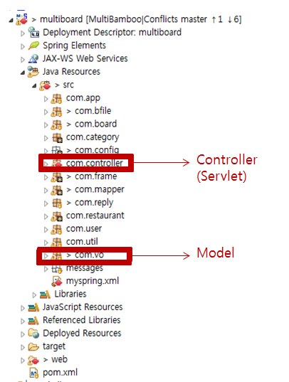

# Spring MVC

## 1. Spring MVC란 ?

Model, View, Controller를 분리한 디자인 패턴

- Model

  - 컨트롤러가 비즈니스 로직 수행 후 사용자에게 반환하여 브라우저에 표시하는 정보(데이터 처리 영역)


  - POJO(Plain Old Java Object) 로 구성됨(ex. Board, Reply ... )
  - Controller에서 주로 Model에 attribute를 붙이거나 리턴해줌.

  **POJO:**

  getter/setter를 가진 단순한 자바 오브젝트

- View

  - 최종 사용자에게 보여줄 프리젠테이션 로직을 담당하는 영역(화면 담당)
  - **JSP**를 통해서 구현됨.

- Controller

  - 요청을 처리하는 부분 
  - 뷰와 모델 사이의 통신 역할
  - **Servlet**

## 2. Model, View, Controller 사이의 관계

- 사용자: Controller에게 요청
- Controller:  Model에게 요청처리 부탁
- Model: 요청 처리 후 요청에 대해 Controller에게 리턴함
- Controller:  리턴값을 받아서 View에게 던짐
- View: 화면에 뿌려줌 


​          참고: <https://min-it.tistory.com/7>

- DispatcherServlet:  모든 클라이언트의 요청을 가장 먼저 처리함

- HandlerMapping: 클라이언트의 요청을 처리할 Controller 매핑

  ​                            얘가 ~.mc 이런 애들 받음, controller로 연결~

- Controller:  실질적인 클라이언트의 요청 처리

- ViewResolver:  Controller가 리턴한 View 이름으로 실행될 jsp 경로 완성 

  ​                         예를 들어 view name: home, prefix: /WEB-INF/views/, suffix: .jsp는 “/WEB-INF/views/home.jsp”라는                       

  ​                         위치의 View(JSP)에 Controller에게 받은 Model을 전달한다.
  참고: https://gmlwjd9405.github.io/2018/12/20/spring-mvc-framework.html

  ## 3. 기본 Project Structure

  

  - src: 
    - Controller, Model,  Service, Dao, Mapper, Test
  - Libraries:
    - jar로 압축한 파일이어야 함.
    - Servlet이나 jsp에서 추가로 사용하는 드라이버 or 라이브러리


- config:  spring configuration files을 저장(spring.xml)

- web.xml: web application의 설정을 위한 web deployment descriptor

  ​               (DispatcherServlet, ContextLoadListener 설정)

- pom.xml: maven configuration file (어떤 lib를 쓸지 명시)

참고: https://gmlwjd9405.github.io/2018/12/20/spring-mvc-framework.html

## 4. Model

- 명명된 객체들의 집합
- attribute key를 이용해서 value값 사용 가능

## 5. View

```jsp
<table class="table table-hover">
	<thead>
		<tr>
			<th width="100px">글번호</th>
			<th width="300px">제목</th>
			<th width="100px">작성자</th>
			<th width="200px">작성일</th>
			<th width="100px">조회수</th>
		</tr>
	</thead>
	<c:forEach var="b" items="${blist }">
		<tr>
			<td>${b.at_id }</td>
			<td><a href="bboarddetail.go?id=${b.at_id }"> ${b.at_title }</a></td>
			<td>${b.u_id }</td>
			<td>${b.at_date }</td>
			<td>${b.at_hits }</td>
		</tr>
	</c:forEach>
</table>
```

- JSP, JSTL, EL로 보통 구현함.

  EL과 JSTL은 JSP에서 보통 자바 코드를 제거하고 싶을 때 사용함

- EL과 JSTL

  - EL: JSP 2.0에서 새로 추가된 스크립트 언어, 기존의 표현식을 대체하는 표현 언어

    ```jsp
    <%= session.getAttribute("userName")%>
    ```

    얘를 이렇게 표현함

    ```jstl
    ${username}
    ```

    JSP에서 사용해야 하는 이런 자바 코드들을 태그 형태로 사용할 수 있도록 지원함.

  - JSTL: JSP로 프로그램 개발하다 보면 if, for , switch 등과 같은 자바 코드를 사용해야 할 때가 있음.

    ​          jsp에서 사용하는 자바코드들을 태그 형태로 사용할 수 있도록 지원함.

    ​

## 6. Controller

```java
@Controller
public class BoardController {
	@Resource(name="bbiz")
	DependenciesBiz<Integer,Board> bbiz;
	@Resource(name="bfbiz")
	DependenciesBiz<Integer,Bfile> bfbiz;
	@Resource(name="rbiz")
	DependenciesBiz<Integer,Reply> rbiz;
	@Autowired
	ServletContext servletContext;

	@RequestMapping("/bhome.go")
	public ModelAndView main() {
		ModelAndView mv = new ModelAndView();
      //model 객체
		mv.addObject("center","centerbamboo");
		mv.addObject("entire","b_board/bsidebar");
		mv.setViewName("home");
		return mv;
	}	
}
```

- @Controller: 클래스 타입에 적용됨, 이 어노테이션을 붙이면 해당 클래스를 웹 요청을 처리하는 컨트롤러로 

  ​                     사용 가능, 이 어노테이션이 적용된 클래스는 <bean>태그에서  스프링 빈으로 등록해주면 됨. 

- @RequestMapping: 특정 URL에 매핑되는 클래스나 메소드임을 나타냄