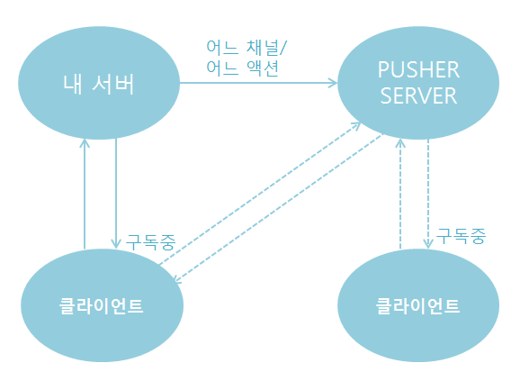

# Day17

- 로그인이 되지 않은 상태에서 글을 작성할 수 없어야 함(Login이 반드시 필요한 기능)

  - 글 작성, 댓글 작성, 좋아요(M:N)
  - 1:N은 거의 다 끝남

- Pusher(실시간 기능 추가)- 외부 API

  - 다른 브라우저에서 보고 있는 친구도 확인 가능함

  

## `좋아요`, `해쉬태그` 구현

- 다대다 테이블을 만드려면 반드시 중간에 Join Table이 있어야 함.
- `좋아요`를 누를 때마다 로우가 하나씩 생성이 됨 
- 컬럼이 딱 2개 뿐임(user_id, article_id)
- django는 기본적으로 null을 인정하지 않음
  - 따로 설정을 하지 않아도 됨.

